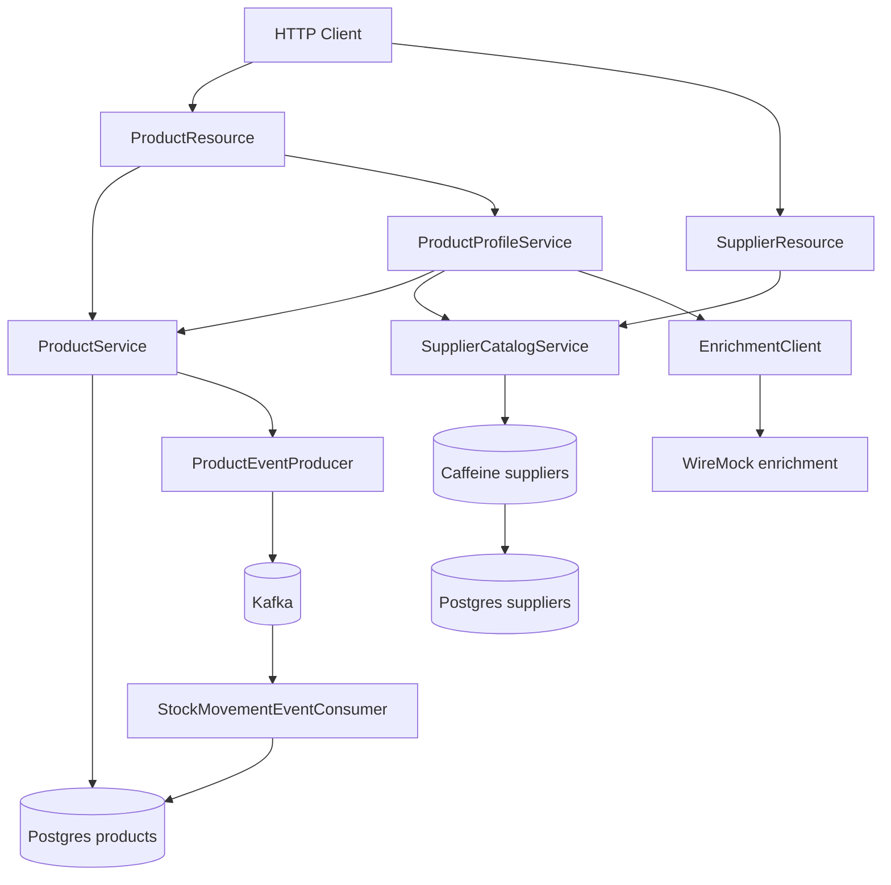
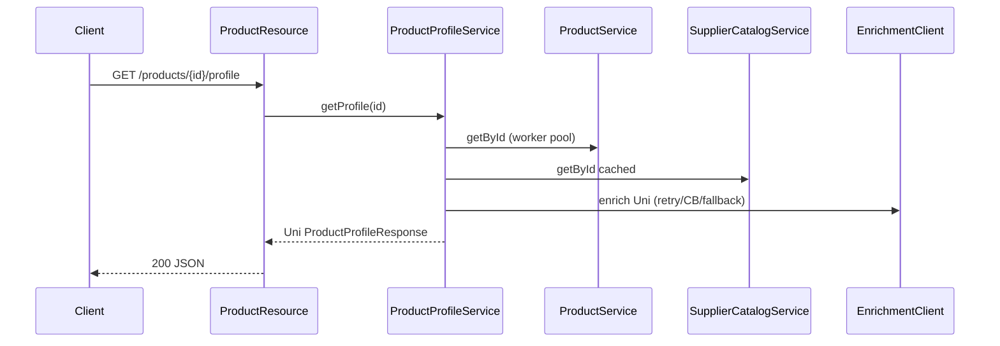

# Product Service Design

POC service aligned with the Quarkus + GraalVM migration playbook (test pyramid, WireMock, k6, OpenAPI-first API).

## Goals

Demonstrate, in one small domain (product / supplier):

1. Sync REST (virtual threads) and async REST (`Uni`)
2. Outbound REST integration with resiliency (Mutiny + SmallRye Fault Tolerance)
3. Kafka producer and consumer
4. Two Postgres databases with Hibernate ORM (named persistence units)
5. Caffeine caching on reference reads
6. Design-first OpenAPI under `src/main/resources/api/`
7. Test pyramid: unit / component / blackbox (OpenAPI validation) / integration
8. Parameterised k6 smoke and 5-minute load

## Domain

| Datasource | Schema | Tables | Role |
|------------|--------|--------|------|
| `products` | `product` | `product`, `stock_movement` | Primary write |
| `suppliers` | `supplier` | `supplier`, `supplier_product` | Reference / read |

### Entity mapping

| Entity | Key fields |
|--------|------------|
| `Product` | `name`, `sku`, `supplierId`, `status`, `creationDate` |
| `StockMovement` | `productId`, `warehouseId`, `status`, `creationDate` |
| `Supplier` | `name`, `city`, `country`, `status` |
| `SupplierProduct` | `supplierId`, `sku`, `name`, `leadTimeDays` |

## Architecture

## Async profile flow

## Tech decisions

| Decision | Choice | Why |
|----------|--------|-----|
| Build | Gradle + `gradlew` | Matches playbook Gradle task hierarchy (`ciTest`, perf tasks) |
| Runtime | Quarkus 3.33 LTS / Java 25 | Full Java 25 support; LTS stream |
| Config | YAML (`quarkus-config-yaml`) | Nested structure for dual datasources and `%test` profile |
| DTOs | Java records + Lombok `@Builder` | Immutability + fluent builders without losing record semantics |
| Entities | Lombok classes | Hibernate needs mutable entities / no-arg ctor |
| Async API | Mutiny `Uni` | Idiomatic Quarkus reactive type (Reactive Streams; interops with Reactor) |
| REST client resiliency | `@Retry` `@Timeout` `@CircuitBreaker` `@Fallback` | Declarative FT on top of reactive client |
| Caching | `quarkus-cache` Caffeine | Zero extra infra for POC |
| Two DBs | Named Agroal datasources + Hibernate PUs + Flyway per DB | Mirrors multi-DB production shapes |
| Contract | `src/main/resources/api/openapi.yaml` | Design-first; blackbox validates responses against it |

## Test pyramid

| Layer | Package prefix | Docker | Notes |
|-------|----------------|--------|-------|
| Unit | `unit.*` | No | Mockito; services, mappers, fallback |
| Component | `component.*` | Yes | Two Postgres Testcontainers |
| Blackbox | `blackbox.*` | Yes | RestAssured + WireMock + OpenAPI validator |
| Integration | `integration.*` | Yes | Real Kafka Testcontainers; `./gradlew integrationTest` only |

Gradle tasks: `test`, `componentTest`, `blackboxTest`, `ciTest`, `integrationTest`, `perfSmoke`, `perfLoad`.

## OpenAPI

- Source: `src/main/resources/api/openapi.yaml`
- Served: `/q/openapi`, Swagger UI at `/q/swagger-ui`
- Blackbox: Atlassian `swagger-request-validator-restassured` filter

## Kafka topics

| Direction | Channel | Topic |
|-----------|---------|-------|
| Out | `product-events` | `quarkus.poc.signal.product.products` |
| In | `stock-events` | `quarkus.poc.signal.product.stock-movements` |

Tests under `ciTest` use `smallrye-in-memory`. Integration tests switch to `smallrye-kafka` via `KafkaIntegrationTestResource`.

## Follow-ons (out of scope for POC)

- OIDC / auth policies
- Native image CI pipeline hardening
- JaCoCo coverage gate
- Gradle publish / Azure DevOps pipeline
