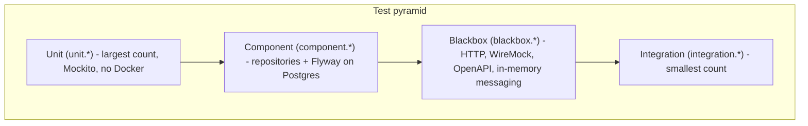

# Testing

This document describes the test strategy for the product service. It follows a test pyramid: many unit tests, fewer component tests, fewer blackbox tests, and a small set of integration tests.

## Test pyramid



Higher tiers exercise more of the stack. Lower tiers run faster and catch most defects.

## Tiers

| Tier | Package prefix | Purpose | Infrastructure | Speed | Relative volume |
|------|----------------|---------|----------------|-------|-----------------|
| Unit | `unit.*` | Services, mappers, fallback logic | None (Mockito) | Fastest | Most tests |
| Component | `component.*` | Repositories and Flyway migrations | Two Postgres Testcontainers | Medium | Fewer than unit |
| Blackbox | `blackbox.*` | Full HTTP stack, contract validation, consumer path | Postgres + embedded WireMock + in-memory messaging | Slower | Fewer than component |
| Integration | `integration.*` | Real Kafka consume and produce | Postgres + Kafka Testcontainers | Slowest | Smallest count |

## What to test at each tier

### Unit

- Test business logic in services, exception mappers, and fallback handlers.
- Mock collaborators with Mockito.
- Do not start Quarkus, Docker, or a database.

### Component

- Test repository persist and find paths against real Postgres schemas.
- Verify Flyway migrations apply correctly.
- Do not test HTTP endpoints or Kafka wiring here.

### Blackbox

- Test REST endpoints with RestAssured against the running Quarkus app.
- Validate request and response bodies against `api/openapi.yaml`.
- Test the stock-movement consumer by sending events through the in-memory connector and asserting persistence via `ProductRepository`.
- Use WireMock for the enrichment API.
- Do not use a real Kafka broker in this tier.

### Integration

- Test the Kafka consume path with a real broker (Testcontainers).
- Run only when you need end-to-end messaging verification.
- Opt in with `./gradlew integrationTest`; this tier is not part of `ciTest`.

## Naming and style

Use this method naming pattern:

```
methodName_when<Condition>_should<Behaviour>
```

Examples: `getById_whenNotFound_shouldReturn404()`, `persistStockMovement_andFindById_shouldRoundTrip()`.

- Use JUnit 5 and AssertJ for assertions.
- Do not add `// Arrange`, `// Act`, or `// Assert` comments.
- Keep test methods short. Extract helpers when setup or assertions repeat.

## Contract testing

Blackbox REST tests use the Atlassian `OpenApiValidationFilter` on every request. The filter checks both the outgoing request and the incoming response against `src/main/resources/api/openapi.yaml`.

Apply `.filter(OPENAPI)` to all RestAssured calls, including setup requests such as `POST /api/v1/products`.

## Messaging testing

The `%test` profile and `PostgresTestResource` set both messaging channels to `smallrye-in-memory`. Blackbox and component tests therefore need no Kafka container.

To trigger the stock-movement consumer in a blackbox test:

```java
@Inject @Connector("smallrye-in-memory") InMemoryConnector connector;

connector.source("stock-events").send(Message.of(objectMapper.writeValueAsString(event)));
```

Poll with Awaitility until `productRepository.findStockMovementById(...)` returns a row.

Integration tests switch to `smallrye-kafka` via `KafkaIntegrationTestResource` and publish to the real topic.

## How to run

| Command | What it runs |
|---------|----------------|
| `./gradlew test` | Unit tests only (`unit.**`) |
| `./gradlew componentTest` | Component tests (`component.**`) |
| `./gradlew blackboxTest` | Blackbox tests (`blackbox.**`) |
| `./gradlew ciTest` | Unit + component + blackbox (PR gate) |
| `./gradlew integrationTest` | Integration tests (`integration.**`); not in `ciTest` |

Docker is required for component, blackbox, and integration tiers.
